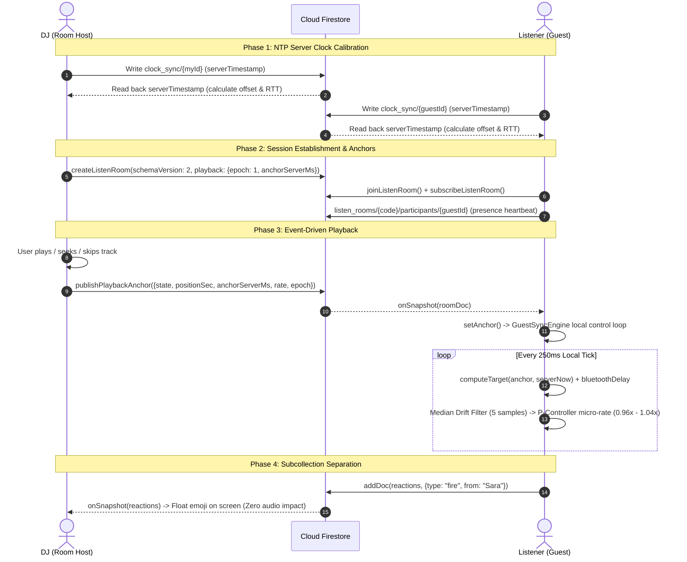

# Party Mode (Listen Together) Synchronization Engine v2

## 1. Overview & Architecture Summary

The **Party Mode (Listen Together) v2** synchronization engine enables multiple devices across varying cellular and Wi-Fi networks to listen to the same song and synchronized lyrics simultaneously in real time.

### Key Achievements in v2:
- **Zero 4-Second Document Spam**: Switched from polling-style Firestore rewrites to an **event-driven timeline anchor model**. Writes occur only on user actions (`play`, `pause`, `seek`, `track`, `rate`), saving >90% Firestore write volume.
- **Continuous Local Control Loop**: Guests run a high-resolution local tick (`GuestSyncEngine`, 250ms interval) that computes host position continuously from `anchor + elapsed * rate` and adjusts playback smoothly with a **Proportional (P) Controller** within ±4% rate delta.
- **Microsecond Clock Calibration**: 3-sample Firestore `serverTimestamp()` NTP calibration round-trips via `clock_sync/{clientId}` with min-RTT sorting (and HTTP header fallback).
- **Sub-Collection Isolation**: Separated presence heartbeats (`participants/{userId}`) and floating emojis (`reactions/{id}`) into subcollections so that guest presence or emoji spam never re-triggers the playback audio sync pipeline.
- **Guest Control Locking**: Guests have transport controls locked with visual cues and polite toast notifications ("Only the DJ controls playback 🎧").
- **Hardware Latency Offset**: Dedicated Bluetooth / external speaker delay slider (0–400ms) with per-device persistent storage.
- **Real-Time Debug Visualizer**: Live diagnostics overlay activated via `?syncdebug=1` featuring live drift metrics and a canvas sparkline.

---

## 2. System Architecture & Data Flow



---

## 3. High-Precision NTP Clock Calibration

Different mobile phones, laptops, and operating systems have system clocks that drift by up to several seconds from true UTC.

### Calibration Method (`FirebaseService.calibrateServerTime`)
1. The client performs up to 3 sequential ping-pong writes to `clock_sync/{clientId}`:
   $$t_0 = \text{Date.now()}$$
   $$\text{Write } \{ t0: t_0, \text{serverTs}: \text{serverTimestamp()} \}$$
   $$t_1 = \text{Date.now()}$$
   $$\text{RTT} = t_1 - t_0$$
   $$\text{Offset} = \text{serverTs} - \left(t_0 + \frac{\text{RTT}}{2}\right)$$
2. The sample with the **minimum RTT** is selected, which minimizes asymmetrical network latency error.
3. If Firestore is offline or unauthenticated, the engine falls back to 3 HTTP `HEAD` requests to the origin checking the `Date` header.
4. Universal server time is queried anytime without network delay:
   $$\text{getServerNow}() = \text{Date.now()} + \text{serverTimeOffsetMs}$$

---

## 4. The Event-Driven Timeline Anchor Model

Instead of broadcasting current playback position every 4 seconds, the host publishes an **Anchor Document**:

```json
{
  "roomCode": "ETHIO-S4XS",
  "schemaVersion": 2,
  "hostId": "usr_abc123_4f8a",
  "hostName": "Abebe",
  "playback": {
    "trackId": "trk_01",
    "state": "playing",
    "positionSec": 24.500,
    "anchorServerMs": 1728100200500,
    "rate": 1.0,
    "epoch": 2
  },
  "currentTrack": {
    "id": "trk_01",
    "title": "Tizita",
    "artist": "Mahmoud Ahmed"
  },
  "isActive": true
}
```

### Guest Target Position Calculation
For any moment in time, the guest calculates exactly where the audio should be:
$$\text{elapsedSec} = \max\left(0, \frac{\text{getServerNow}() - \text{anchorServerMs}}{1000}\right) \times \text{rate}$$
$$\text{targetTime} = \begin{cases} 
\text{positionSec} + \text{elapsedSec} + \text{audioDelaySec} & \text{if state} = \text{'playing'} \\
\text{positionSec} + \text{audioDelaySec} & \text{if state} = \text{'paused'}
\end{cases}$$

---

## 5. Continuous Proportional (P) Rate Controller

Rather than coarse step-based rate adjustments, `GuestSyncEngine` uses a proportional controller with settling protection and median filtering:

1. **5-Sample Median Filter**: Removes cellular transmission spikes and garbage collection pauses.
2. **Deadband Hysteresis**:
   - Inside deadband ($\le 30\text{ms}$): tempo multiplier is strictly $1.0\times$.
   - Exit threshold ($> 65\text{ms}$): starts smooth correction.
3. **P-Gain Correction**:
   $$\text{rateMultiplier} = 1.0 + \text{clamp}\left(K_p \times \text{medianDrift}, -0.04, +0.04\right)$$
   Where $K_p = 0.12$.
4. **Hard Sync Threshold ($> 1.25\text{s}$)**:
   If drift exceeds 1.25s or when the host bumps the `epoch` (explicit seek or track change), the engine performs a direct `player.seek(target + seekLead)` with dynamic seek lead compensation (typically 35ms) to compensate for audio decoder decode warmup.

| Drift Range | Action | Audio Quality |
| :--- | :--- | :--- |
| $\lvert\text{drift}\rvert \le 30\text{ms}$ | Rate = $1.0\times$ (In Sync) | 100% natural, pristine audio |
| $30\text{ms} < \lvert\text{drift}\rvert \le 1250\text{ms}$ | Rate smoothly nudged between $0.96\times$ and $1.04\times$ | Pitch preserved (`preservesPitch = true`), imperceptible tempo nudge |
| $\lvert\text{drift}\rvert > 1250\text{ms}$ or `epoch` bumped | Direct seek to target + seek lead | Immediate realignment |

---

## 6. Firestore Security Rules

To secure rooms, participants, reactions, and time calibration, apply the following rules in Firebase Console:

```javascript
rules_version = '2';
service cloud.firestore {
  match /databases/{database}/documents {

    // 1. Listen Rooms
    match /listen_rooms/{roomCode} {
      allow read: if true;
      allow create: if request.resource.data.schemaVersion == 2
                    && request.resource.data.hostId != null;
      allow update: if resource.data.isActive == true
                    && (
                      // Host can update playback, tracks, or close room
                      request.auth.uid == resource.data.hostId
                      || request.resource.data.hostId == resource.data.hostId
                      // Or another participant claiming host handover
                      || request.resource.data.diff(resource.data).affectedKeys().hasOnly(['hostId', 'hostName', 'hostAvatar', 'playback', 'updatedAt'])
                    );
      allow delete: if false; // Soft-delete via isActive: false

      // 2. Participants subcollection (Presence)
      match /participants/{participantId} {
        allow read: if true;
        allow create, update: if request.resource.data.name is string;
        allow delete: if true;
      }

      // 3. Reactions subcollection (Live Emojis)
      match /reactions/{reactionId} {
        allow read: if true;
        allow create: if request.resource.data.type in ['fire', 'heart', 'music', 'sparkle'];
        allow update, delete: if false;
      }
    }

    // 4. Clock Sync (NTP Ping/Pong)
    match /clock_sync/{clientId} {
      allow read, write: if true;
    }
  }
}
```

---

## 7. Presence, Heartbeat & Host Failover

1. **Heartbeat Frequency**: Every 30 seconds, each participant updates `/participants/{id}` with `lastSeen = serverTimestamp()` and their current `driftMs`.
2. **Host Dropout Detection**: Guests monitor active participants. If the host has not sent a heartbeat for $> 90$ seconds, the room initiates **Host Handover**.
3. **Deterministic Promotion**: The active participant with the earliest `joinedAt` timestamp claims the DJ role using `FirebaseService.claimHost()`, which increments `playback.epoch` and transfers host privileges without breaking the room session.

---

## 8. UX Features & Debugging Tools

### Live Sync Status Chip (`#roomBarSyncChip`)
Located directly in the floating room bar and modal:
- **DJ 👑**: Displayed for the room host.
- **In sync (±18ms) 🟢**: Displayed when inside the deadband.
- **Nudging (+45ms) 🟡**: Displayed when micro-rate correction is active.
- **Seeking... 🟠**: Displayed during hard realignment.
- **Tap to Play 🎧**: Displayed if mobile autoplay policy requires a user gesture. Clicking the chip automatically unlocks audio and resyncs.

### Bluetooth / Speaker Latency Slider (`#sliderAudioDelay`)
Accessible in the Party Room modal under **Sync & Audio Latency**:
- Adjustable slider from 0ms to 400ms (10ms steps).
- Compensates for Bluetooth audio latency, soundbar processing delays, and external DAC buffers.
- Stored persistently per-device in `localStorage`.

### Real-Time Diagnostics Overlay (`?syncdebug=1`)
Append `?syncdebug=1` to the URL (e.g. `http://localhost:5173/?syncdebug=1`) to open the floating HUD:
- **Clock Offset & Best RTT**: Shows NTP calibration stats.
- **Engine State**: `in-sync`, `syncing`, `buffering`, `blocked`.
- **Live & Median Drift**: Real-time drift values.
- **Rate Multiplier**: Live playback rate (e.g. `1.018x`).
- **Dynamic Sparkline**: Canvas graph plotting drift history with deadband visual zone.

---

## 9. Testing & Verification

1. **Two-Tab Local Sync Test**:
   - Open Tab 1: `http://localhost:5173/?syncdebug=1`
   - Open Tab 2: `http://localhost:5173/?syncdebug=1` (or incognito window)
   - Tab 1: Click "Party" > "Start Session". Note the 4-letter room code (e.g. `S4XS`).
   - Tab 2: Click "Party" > "Join Session", enter the code, and click "Join".
   - Notice:
     - Tab 2 displays the live sync chip and locked controls.
     - Trying to click Play/Pause or scrub in Tab 2 triggers the "Only the DJ controls playback 🎧" toast.
     - Scrubbing or changing songs in Tab 1 immediately triggers an anchor broadcast with epoch bump, bringing Tab 2 into alignment.
     - Both tabs render floating reactions without interrupting audio streaming.
2. **Simulation Suite**:
   - Run `node scratch/test_party_sync.mjs` to execute all 30 automated test cases for clock calculation, median windowing, P-rate settling, and anchor convergence.
