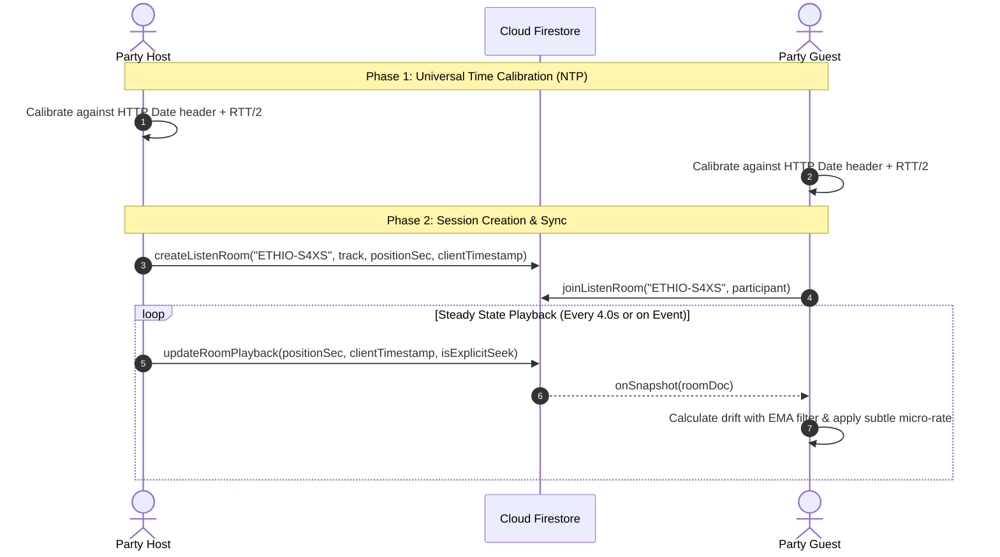

# Party Mode (Listen Together) Synchronization Engine

## 1. Overview
The **Party Mode (Listen Together)** feature enables multiple users across different devices and networks to listen to the same song and synchronized lyrics simultaneously in real time.

The system is built on top of **Google Cloud Firestore (real-time `onSnapshot` listeners)** and a **High-Precision Client NTP Calibration Engine** with zero backend infrastructure requirements.

---

## 2. Architecture & Data Flow



---

## 3. High-Precision Time Calibration (Client NTP)

Different phones, laptops, and operating systems can have their internal clocks off by hundreds of milliseconds or even seconds. To synchronize playback accurately:

1. **Calibration Method (`FirebaseService.calibrateServerTime`)**:
   - The app sends 3 sequential lightweight `HEAD` requests to the origin server with `cache: 'no-store'`.
   - For each request:
     $$\text{RTT} = t_1 - t_0$$
     $$\text{ServerEpoch} = \text{Date}(\text{response.headers.get('date')}) + \frac{\text{RTT}}{2}$$
     $$\text{Offset} = \text{ServerEpoch} - \text{Date.now()}$$
   - The median of the samples is stored as `serverTimeOffsetMs`.
2. **Universal Clock (`FirebaseService.getServerNow()`)**:
   $$\text{UniversalTime} = \text{Date.now()} + \text{serverTimeOffsetMs}$$

---

## 4. Drift Calculation & The Dual-Mode Sync Algorithm

When a guest receives a room snapshot from Firestore:

### A. Target Playback Position
$$\text{elapsedSec} = \max\left(0, \frac{\text{getServerNow()} - \text{room.clientTimestamp}}{1000}\right)$$
$$\text{targetTime} = \begin{cases} 
\text{room.positionSec} + \text{elapsedSec} & \text{if room is playing} \\
\text{room.positionSec} & \text{if room is paused}
\end{cases}$$

### B. Exponential Moving Average (EMA) Drift Filter
Network latency over cellular/Wi-Fi fluctuates with jitter. Reacting to raw, single-packet jitter causes jerky audio. We smooth the raw drift with an exponential filter:
$$\text{smoothedDrift}_t = 0.65 \times \text{smoothedDrift}_{t-1} + 0.35 \times \text{rawDrift}_t$$
where $\text{rawDrift} = \text{targetTime} - \text{player.currentTime}$.

---

## 5. Synchronization Thresholds (Subtle & Non-Aggressive)

| Condition | Threshold | Action | User Experience |
| :--- | :--- | :--- | :--- |
| **Deliberate Seek** | `isExplicitSeek == true` | `player.seek(targetTime)` | Immediate jump to match host skip/seek |
| **Large Disconnect** | $\lvert\text{drift}\rvert > 1.25\text{s}$ | `player.seek(targetTime)` | Clean jump (only if completely out of phase) |
| **Deadband (In Sync)** | $\lvert\text{drift}\rvert < 0.07\text{s}$ (70ms) | `playbackRate = 1.0` | Pristine native playback, no adjustments |
| **Minor Lag** | $+0.07\text{s} < \text{drift} \le +0.30\text{s}$ | `playbackRate = 1.018` (+1.8%) | Imperceptible catch-up over ~4–5 seconds |
| **Minor Lead** | $-0.30\text{s} \le \text{drift} < -0.07\text{s}$ | `playbackRate = 0.982` (-1.8%) | Imperceptible slow-down over ~4–5 seconds |
| **Moderate Lag** | $+0.30\text{s} < \text{drift} \le +1.25\text{s}$ | `playbackRate = 1.035` (+3.5%) | Smooth acceleration without audio skips |
| **Moderate Lead** | $-1.25\text{s} \le \text{drift} < -0.30\text{s}$ | `playbackRate = 0.965` (-3.5%) | Smooth deceleration without audio skips |

### Why This Prevents Glitches:
- **No Audible Pitch Shifting**: `audioElement.preservesPitch = true` ensures micro-rate adjustments alter tempo without pitch warbling.
- **No Audio Drops**: Avoiding `player.seek()` for small discrepancies keeps the HTML5 audio decoder buffer continuous and click-free.
- **Relaxed Heartbeat**: Sending updates every 4 seconds (instead of 1.5s) reduces Firestore churn and allows the micro-rate compensation to settle smoothly.

---

## 6. Firestore Document Schema (`listen_rooms/{roomCode}`)

```json
{
  "roomCode": "ETHIO-S4XS",
  "hostId": "usr_918237",
  "hostName": "Abebe",
  "hostAvatar": "https://...",
  "currentTrack": {
    "id": "trk_01",
    "title": "Tizita",
    "artist": "Mahmoud Ahmed",
    "album": "Soul of Addis",
    "year": "1975",
    "cover": "assets/weleta_cover.jpg",
    "audioUrl": "https://pub-...r2.dev/tizita.mp3",
    "lrc": "[00:12.30]..."
  },
  "playbackState": "playing",
  "positionSec": 42.15,
  "clientTimestamp": 1728100200150,
  "isExplicitSeek": false,
  "participants": [
    {
      "id": "usr_918237",
      "name": "Abebe",
      "avatar": "...",
      "isHost": true,
      "joinedAt": 1728100000000
    }
  ],
  "reactions": [
    {
      "id": "rx_1728100210000_a8f9",
      "type": "heart",
      "from": "Sara",
      "timestamp": 1728100210000
    }
  ],
  "isActive": true,
  "createdAt": "Timestamp",
  "updatedAt": "Timestamp"
}
```

---

## 7. Developer Guide & Contributing

1. **Testing Sync Locally**:
   - Open an incognito window or a second browser profile.
   - In window 1, start a session and click "Party". Copy the 4-character code (e.g. `S4XS`).
   - In window 2, click "Party" > "Join Session", type `S4XS` and click Join.
   - Observe the playback rate and timeline behavior in the DevTools console.
2. **Handling Offline Drops**:
   - If a participant loses internet connection, the `onSnapshot` listener automatically reconnects when connectivity returns and resyncs to the host's current position.
3. **Host Handover**:
   - If the host leaves or closes the tab, `leaveListenRoom()` automatically promotes the next participant to Host, maintaining continuous session continuity.
