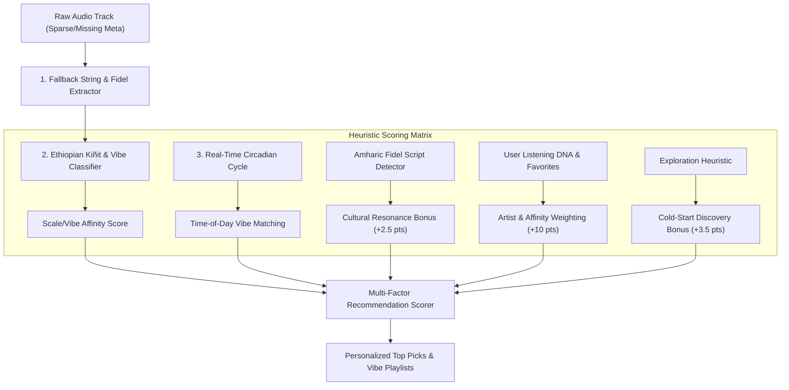
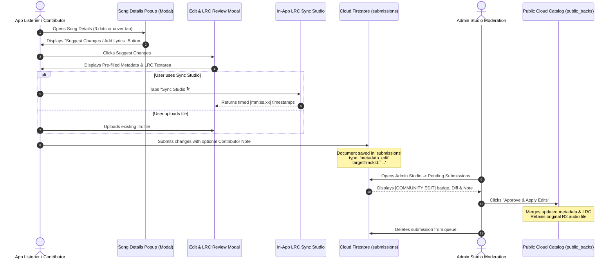

# Recommendation Engine Architecture & Community Metadata Moderation System

## Executive Summary

In Ethiopian and diaspora music streaming environments, audio files frequently suffer from missing, unstandardized, or sparse metadata (e.g., filenames like `Aster_Aweke_Track02.mp3`, raw Amharic Fidel strings without transliterations, or missing album and genre tags). 

To solve this without degrading user experience or depending on expensive external APIs, **Ethio-Lyrics Player** implements a two-pillar strategy:
1. **Algorithmic Fallback & Cultural Heuristic Engine**: An intelligent recommendation system that derives rich musical traits from raw strings, durations, script detection, and time-of-day vibe matrices even when explicit metadata is completely absent.
2. **Community Crowdsourced Metadata & Synchronized LRC Moderation System**: A seamless in-app contribution workflow enabling users to suggest title corrections, Latin transliterations, release years, cover artwork, and timed `.lrc` lyrics directly from the Song Details modal, queued for admin verification and 1-click catalog merge.

---

## 1. Recommendation System Under Sparse Metadata



### A. Dynamic Fallback Extraction
When metadata fields (`artist`, `title`, `album`) are missing or null:
- **Delimiter Parsing**: The engine splits track titles or audio filenames containing ` - `, `_`, or `—` (e.g., `"Tilahun Gessesse - Sithed Siketelat"` $\rightarrow$ Artist: *Tilahun Gessesse*, Title: *Sithed Siketelat*).
- **Extension & Artifact Cleaning**: Strips audio file extensions (`.mp3`, `.m4a`, `.wav`, `.aac`) and cleans trailing underscores and numeric track suffixes (`track_01`, `(Audio)`).
- **Ge'ez / Fidel Script Recognition**: Evaluates character code ranges (`\u1200-\u137F`). If Fidel characters are detected, the track receives immediate classification as authentic Ethiopian repertoire and grants a cultural affinity bonus.

### B. Ethiopian Musical Kiñit (ቅኝት) & Vibe Heuristics
Traditional Ethiopian music is organized around 4 primary pentatonic scales (*Kiñit*): **Tizita**, **Bati**, **Ambassel**, and **Anchihoye**, alongside modern regional rhythms (**Eskista**, **Gurage**, **Wollo**, **Oromo**, **Tigrigna**, **Ethio-Jazz**, and **Ethio-Reggae**).

When songs lack genre metadata, the engine runs lexical and acoustic heuristics:
1. **Keyword-to-Scale Mapping**:
   - `ትዝታ` / `Tizita` $\rightarrow$ Nostalgic / Soulful Ballad
   - `ባቲ` / `Bati` $\rightarrow$ Melancholic Blues
   - `አምባሰል` / `Ambassel` $\rightarrow$ Highland Classic
   - `አንቺሆዬ` / `Anchihoye` $\rightarrow$ Uplifting / Passionate
   - `እስክስታ` / `Eskista` $\rightarrow$ High Energy / Shoulder Dance
   - `ጉራጊኛ` / `Gurage` $\rightarrow$ Fast Polyrhythmic Groove
   - `ኦሮሚኛ` / `Oromo` / `ትግርኛ` / `Tigrigna` $\rightarrow$ Regional Grooves
   - `Jazz` / `ያዝ` $\rightarrow$ Ethio-Jazz / Instrumental
2. **Duration-Based Rhythm Inference**:
   - $\text{Duration} \ge 300\text{ seconds (5+ minutes)}$: Highly correlates with slow, contemplative *Tizita* or live Ethiopian orchestra recordings $\rightarrow$ classified as **Tizita / Soulful Ballad**.
   - $\text{Duration} \le 210\text{ seconds (< 3.5 minutes)}$: Correlates with modern fast-tempo radio singles and dance releases $\rightarrow$ classified as **Upbeat Pop / Eskista**.

### C. Circadian Time-of-Day Alignment
The recommendation engine adjusts rankings depending on when the user is listening:
| Time Window | Ethiopian Mood | Preferred Vibe Class | Fallback Scoring Rule |
| :--- | :--- | :--- | :--- |
| **Morning (05:00 - 12:00)** | የማለዳ ወግ (Morning Serenity) | Acoustic, Bati, Ethio-Jazz, Warm Ballads | Prioritizes mid-tempo melodic tracks |
| **Afternoon (12:00 - 18:00)** | የከሰዓት ሙቀት (Daytime Flow) | Upbeat, Modern Pop, Anchihoye | Boosts medium & high energy tracks |
| **Evening (18:00 - 23:00)** | የምሽት ዜማ (Evening Social/Party) | Eskista, Gurage, Dance, High Tempo | Maximum weight on high tempo & groove |
| **Night (23:00 - 05:00)** | የለሊት ትዝታ (Late Night Nostalgia)| Tizita, Soulful, Slow Classics (>5 min) | Boosts long reflective acoustic songs |

### D. Cold-Start Discovery & Anti-Echo-Chamber Bonus
To prevent the system from repeatedly playing only the few songs with full metadata:
- Tracks with 0 historical plays or minimal metadata receive an **Exploration Bonus (+3.5 pts)**.
- Tracks with synced LRC lyrics receive a **Lyrics Bonus (+3.0 pts)** to prioritize rich karaoke experiences.
- Favorite artist matches receive a **Loyalty Bonus (+10.0 pts)**.

---

## 2. Community Metadata & Synchronized Lyrics Review System

To permanently enrich sparse metadata, a crowdsourced contribution and moderation pipeline was built directly into the player.



### A. User-Facing Workflow
1. **Entry Point**: In the **Song Details** modal (`#songDetailsModal`), a prominent action button:
   - **`#btnDetailEditSong`**: labeled `"Suggest Changes / Add Lyrics"`.
2. **Review Modal (`#editSongReviewModal`)**:
   - **Visual Header**: Displays the current target track's cover, title, and artist to eliminate ambiguity.
   - **Bilingual Title & Artist Inputs**: Ge'ez (Amharic) and Latin transliteration fields (`title`, `titleEn`, `artist`, `artistEn`).
   - **Discography Metadata**: Album name and Release Year.
   - **Artwork URL**: Custom image link for verified high-resolution cover art.
   - **Timed Lyrics Editor**: 
     - Multi-line textarea for standard `.lrc` format (`[mm:ss.xx] Lyrics line`).
     - **"Upload .lrc"** button for importing existing files via browser `FileReader`.
     - **"Sync Studio 🎙️"** button linking directly to the built-in live lyric synchronizer.
   - **Contributor Note**: Allows the user to explain changes (e.g., *"Fixed Amharic typo in chorus, added 1998 release year, and synced timestamps"*).

### B. Firestore Submission Schema
Submissions are stored in the `submissions` collection:
```json
{
  "id": "sub_xyz789",
  "type": "metadata_edit",
  "targetTrackId": "track_12345",
  "originalTitle": "Aster_Track02",
  "originalArtist": "Aster",
  "title": "ካይኔ አይወጣም",
  "titleEn": "Kayne Aywetam",
  "artist": "አስቴር አወቀ",
  "artistEn": "Aster Aweke",
  "album": "Kabu",
  "year": "1991",
  "cover": "https://pub-r2.com/aster_kabu.jpg",
  "lrc": "[00:15.30]ካይኔ አይወጣም ምስልህ...\n[00:20.10]በልቤ ታትሞ...",
  "audioUrl": "https://pub-r2.com/aster_kabu.mp3",
  "contributorNote": "Corrected Fidel spelling and synced lyrics with official album version",
  "submittedByEmail": "fan@gmail.com",
  "submittedByName": "Dawit",
  "submittedAt": "2026-10-05T07:55:00Z",
  "status": "pending"
}
```

### C. Admin Studio Moderation Workflow
In `Admin Studio` (`#adminModal`):
1. **Visual Distinction**:
   - Edits are flagged with a gold **`[COMMUNITY EDIT]`** badge instead of `[NEW TRACK]`.
   - Displays both original title/artist and proposed updates.
   - Highlighted **Contributor Note** block with a gold accent bar.
2. **Audio Protection**:
   - For `metadata_edit`, the Cloudflare R2 audio URL input is optional. If left blank, the existing streaming audio asset is preserved without re-uploading.
3. **1-Click Merge Execution**:
   - When the admin clicks **`Approve & Apply Edits`**, `FirebaseService.approveSubmission()` executes a Firestore `setDoc(docRef, updateData, { merge: true })` on `public_tracks/{targetTrackId}` and immediately purges the item from `submissions`.
   - The global catalog updates instantly in real time for all users worldwide.

---

## 3. Data Flywheel Effect

```
   [Sparse Audio Uploads] 
             │
             ▼
   [Recommendation Heuristics (Kiñit/Vibe/Exploration)] 
             │
             ▼
   [Listeners Enjoy & Identify Missing Data] 
             │
             ▼
   [User Suggests Edits & Synced Lyrics] 
             │
             ▼
   [Admin 1-Click Verification] 
             │
             ▼
   [Rich Verified Metadata & Synced LRC] 
             │
             └────────► [Stronger Recommendations & Smarter Playlists]
```

As the community listens and submits corrections, unlabelled songs are upgraded into rich catalog entries with synchronized lyrics, creating an expanding, self-healing Ethiopian music repository.
